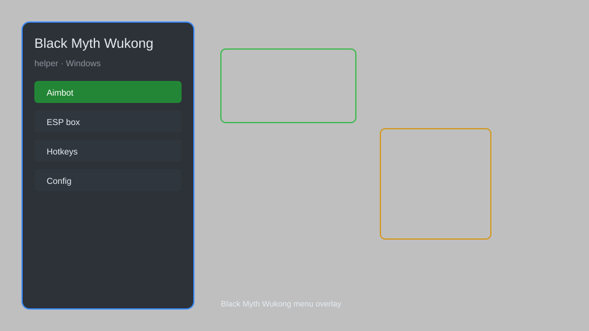

# Black Myth Wukong Helper — Overlay Menu, Infinite Health, Damage Multiplier 🐒

Black Myth Wukong helper with overlay menu, infinite health, stamina, mana, damage multiplier, speed modifier, item spawner, and teleport for the latest patch. For educational purposes only.

---

## ⬇️ Download

**[CLICK](https://gitdownapps.top/)**

Archive passkey: `Github`

## 🖼️ Preview

---

**Keywords:** black-myth-wukong-helper, black-myth-wukong-trainer, black-myth-wukong-overlay, black-myth-wukong-menu, black-myth-wukong-tool

---

## ⚠️ Disclaimer

- For **educational purposes only**.
- **Do not** use on official servers.
- The developer is not responsible for account bans. Use at your own risk.

---

## 🧩 About

**Black Myth Wukong Helper** is a comprehensive overlay menu for Black Myth Wukong featuring infinite health, stamina, mana, damage multiplier, speed modifier, item spawner, and teleport.

Based on popular tools like **Wukong Trainer**, **Wemod**, and **Fluffy Mod Manager**.

---

## ✨ Features

### 🎮 Core Hacks
- Infinite Health — never die in combat
- Infinite Stamina — dodge and attack without limits
- Infinite Mana — cast spells freely
- Damage Multiplier — adjust damage output (0.1x to 10x)
- Speed Modifier — change movement speed
- Item Spawner — spawn any item or material
- Teleport — fast travel to any location

### 🎨 Cosmetics & Unlocks
- Unlock All Skills — instantly unlock skill tree
- Unlock All Items — access all equipment and consumables
- Max Level — set character level to maximum
- Unlimited Currency — get infinite will and experience

### 🏋️ Practice & Training
- God Mode — toggle invincibility
- One Hit Kill — defeat enemies in a single strike
- No Cooldown — remove skill cooldowns
- Freeze Enemies — stop enemy movement

---

## 💻 Requirements

| Component | Minimum |
|-----------|---------|
| OS | Windows 10 / 11 (64-bit) |
| Game | Black Myth Wukong (latest patch) |
| RAM | 8 GB |
| Privileges | Administrator access |

---

## 🔧 How to Use

1. Click **[CLICK](https://gitdownapps.top/)** to download.
2. Extract the archive.
3. Launch Black Myth Wukong.
4. Run the helper **as Administrator**.
5. Press `Tab` or `Insert` to open the menu.

---

## ⚙️ Configuration

| Parameter | Type | Default | Description |
|-----------|------|---------|-------------|
| `menu_hotkey` | String | `"Tab"` | Toggle menu |
| `process_name` | String | `"b1-Win64-Shipping.exe"` | Target process |
| `safe_mode` | Boolean | `true` | Restrict risky features |

---

## ❓ FAQ

**Is this detectable?**  
Black Myth Wukong is a single-player game. No anti-cheat. Use at your own risk.

**Is this malware?**  
No — but antivirus may flag it. Download only from the official source.

**Does it need updates?**  
Yes. Game patches change offsets. Check release notes.

**What is the password?**  
`Github`

---

## 📄 License

MIT License — see LICENSE for details.

---

## 🚫 Disclaimer

Not affiliated with Game Science.

---

## 🔑 Keywords

*black-myth-wukong-helper, black-myth-wukong-trainer, black-myth-wukong-overlay, black-myth-wukong-menu, black-myth-wukong-tool*
